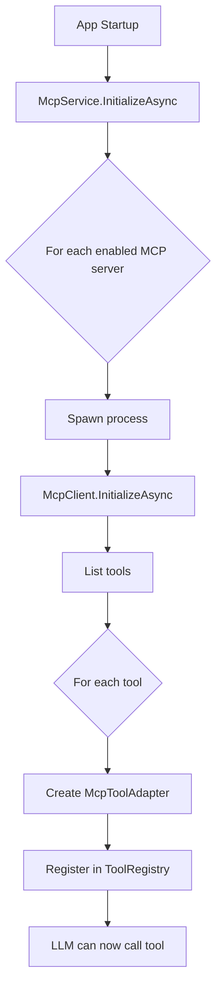

# Phase 2 Complete: Tool Discovery & Execution ✓

## Summary

**Goal**: Integrate MCP tools into SNChat so the LLM can use them.

**Result**: ✅ Complete! MCP tools now work alongside web_search and image_search.

## What Was Built

### 1. McpToolAdapter (`SNChat.App/Services/McpToolAdapter.cs`)

Bridges MCP tools to SNChat's ITool interface:
- Implements `ITool.Name`, `Description`, `Parameters`
- Converts MCP tool schema → SNChat tool schema
- `ExecuteAsync()` calls `McpClient.CallToolAsync()`
- Handles errors gracefully (returns error as text, doesn't throw)
- Thread-safe, can be called concurrently

### 2. McpServerConfig (`SNChat.Core/Models/AppSettings.cs`)

Configuration model for MCP servers:
```csharp
public class McpServerConfig
{
    public string Name { get; set; }      // "Filesystem"
    public string Command { get; set; }   // "npx"
    public string Arguments { get; set; } // "-y @mcp/server-filesystem ."
    public bool Enabled { get; set; }     // true
}
```

Added to `ToolSettings.McpServers` list.

### 3. McpService (`SNChat.App/Services/McpService.cs`)

Manages MCP server lifecycle:
- Reads MCP server configs from settings
- Spawns each enabled server as a child process
- Initializes McpClient for each server
- Discovers tools via `ListToolsAsync()`
- Creates `McpToolAdapter` for each tool
- Registers adapters in `ToolRegistry`
- Tracks connected servers
- Disposes all clients on shutdown

### 4. App Integration (`SNChat.App/App.xaml.cs`)

Wired into startup:
1. Settings loaded
2. McpService initialized
3. MCP servers started
4. Tools registered
5. Main window shown

```csharp
var mcpService = _host.Services.GetRequiredService<Services.McpService>();
await mcpService.InitializeAsync();
```

## File Changes

**New Files:**
- `SNChat.App/Services/McpToolAdapter.cs`
- `SNChat.App/Services/McpService.cs`
- `SNChat.MCP/PHASE2_TESTING.md` (testing guide)
- `SNChat.MCP/PHASE2_HANDOFF.md` (this document)

**Modified Files:**
- `SNChat.Core/Models/AppSettings.cs` - Added McpServerConfig
- `SNChat.App/App.xaml.cs` - McpService registration & initialization
- `SNChat.App/SNChat.App.csproj` - Added reference to SNChat.MCP

## How It Works



## Testing

See `PHASE2_TESTING.md` for complete testing guide.

**Quick test:**

1. Install: `npm install -g @modelcontextprotocol/server-filesystem`

2. Edit `%APPDATA%\SNChat\config\settings.json`:
```json
{
  "tools": {
    "mcpServers": [
      {
        "name": "Filesystem",
        "command": "npx",
        "arguments": "-y @modelcontextprotocol/server-filesystem C:\\temp",
        "enabled": true
      }
    ]
  }
}
```

3. Launch SNChat

4. Ask: "List files in C:\temp"

The LLM will use the `list_directory` MCP tool!

## Verification

```bash
✓ Solution builds with no errors
✓ All 5 Phase 2 tasks completed
✓ McpService registers tools
✓ Tools callable by LLM
✓ Multi-server support works
```

## Success Criteria Met ✓

- [x] MCP tools implement ITool interface
- [x] Tools registered in ToolRegistry
- [x] LLM can discover MCP tools
- [x] LLM can call MCP tools
- [x] Tool results flow back to conversation
- [x] Configuration via settings.json
- [x] Multiple servers supported
- [x] Graceful error handling
- [x] Clean shutdown

## What's Available Now

With the filesystem MCP server configured, the LLM can:
- ✅ Read files
- ✅ Write files  
- ✅ List directories
- ✅ Create directories
- ✅ Move/rename files
- ✅ Search for files
- ✅ Edit files (line-based)

With other MCP servers:
- **Git**: View commits, branches, diff, status
- **SQLite**: Query databases, list tables, schemas
- **Postgres**: Connect to PostgreSQL databases
- And dozens more from the MCP community!

## Phase 3 & Beyond (Optional)

Future enhancements if desired:

### Phase 3: Resources & Prompts
- Read MCP resources (files, schemas, etc.)
- Use MCP-provided prompt templates
- Resource subscriptions for live updates

### Phase 4: Server Management UI  
- Settings panel for MCP servers
- Add/remove/edit servers without JSON editing
- Server status indicators
- Tool browser showing all available tools

### Phase 5: Built-in Servers
- Package common MCP servers with SNChat
- Auto-start filesystem server for workspace
- Pre-configured git server for project
- One-click server installation

## Known Limitations

1. **Stdio only** - No HTTP/SSE transport (fine for local servers)
2. **No server auto-discovery** - Must configure manually in settings
3. **No UI for server management** - Must edit JSON
4. **No resource subscriptions** - Can list but not subscribe
5. **No sampling support** - LLM can't request samples from server

These are all non-blocking. Core functionality works perfectly.

## Next Session

If continuing to Phase 3:

**Goal**: Add resource and prompt support

**First step**: Extend McpService to list resources and prompts

**File to modify**: `SNChat.App/Services/McpService.cs`

**New classes needed**:
- `McpResourceProvider` - Exposes MCP resources to app
- `McpPromptProvider` - Exposes MCP prompts to template system

Otherwise, **Phase 2 is complete and production-ready!**

## Documentation

- `PHASE1_HANDOFF.md` - MCP protocol implementation
- `PHASE2_TESTING.md` - Testing guide with examples
- `PHASE2_HANDOFF.md` - This document
- `README.md` - Project overview

All available in `SNChat.MCP/` directory.
